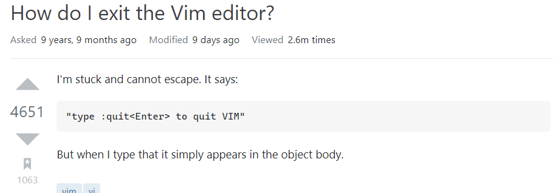

# Vim
## Text File Editor
### Presentations

# Introduction: Me

* I
    * am a
        * backend developer
    * am from Commit Khong


# Introduction: Topic

# Vim: A Text File Editor

## Installation

It's likely that vim already pre-install in your os, or if it's not:

```bash
git clone https://github.com/vim/vim.git
cd vim/src
make
```

# Why?

* Editing over typing
* Fast navigation
* No mouse
* Efficiency
* It speaks the hunan-language when typing
    * More intuitive than Nano :))

# Why: Part 2 - Examples

For example, delete all the parameters of method

* hit `d` `i` `)` (or `(`)
    * `d` means delete
    * `i` means inside
    * `)` means, yes `parentheses`

# How: Be efficient

* know where the cursor is
* know where the action should be trigger

# How: Be creative

* use mapping to group the common task
* programable with vimscript

# Summary

> Vim has steep learning curve.
> However, when you're master it, it's hard to quit.

# Resources

* 
* [Mark Gruber, Markdown Co-Creator](https://daringfireball.net/projects/markdown/syntax#philosophy)
* [lookatme](https://github.com/d0c-s4vage/lookatme)

